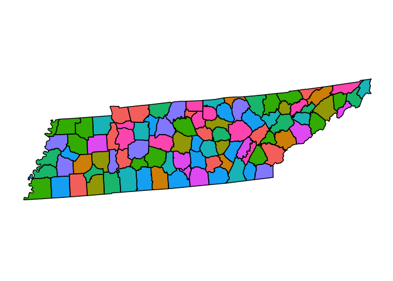

construct-county-map-data.R
================
johngraves
Wed Jan 16 16:37:30 2019

``` r
suppressWarnings(suppressMessages(source(here::here("/R/manifest.R"))))
source(here("R/move-ak-hi.R"))
source(here("R/get-geographic-info.R"))
source(here("R/map-theme.R"))

county_map <- readOGR(dsn=here("public-data/shape-files/county-2017/cb_2017_us_county_5m/cb_2017_us_county_5m.shp"),
                      layer = "cb_2017_us_county_5m",verbose = FALSE) 

# Get Gegographic Information (e.g., centroid, contiguous geographies, etc.)
df_county_info <- 
  county_map %>% 
    subset(GEOID != "99") %>% 
    get_geograhic_info()

# Create a ggplot-friendly map data frame.
county_map <- move_ak_hi(county_map,type="county")
county_map$fips_code <- paste0(county_map$GEOID)
county_map$lng <- unlist(lapply(county_map@polygons, function(dt) dt@labpt[1]))
county_map$lat <- unlist(lapply(county_map@polygons, function(dt) dt@labpt[2]))
# Project to albers
county_map <- spTransform(county_map,CRS("+proj=aea +lat_1=29.5 +lat_2=45.5 +lat_0=37.5 +lon_0=-96"))

# simplify the polgons a tad (tweak 0.00001 to your liking)
#simplify_polygon = FALSE
#if (simplify_polygon) df_map <- gSimplify(df_map, tol = 0.00001)
county_map <- gBuffer(county_map, byid=TRUE, width=0)

df_county_map = fortify(county_map,region = "fips_code") %>%
  rename(fips_code = id) %>%
  dplyr::select(fips_code,everything()) %>% 
  tbl_df()

write_rds(df_county_map,here("output/tidy-mapping-files/county/","df_county.rds"))

df_county_map %>%
  filter(grepl("^47",fips_code)) %>%
  tbl_df() %>%
  mutate(test = factor(sample(1:10,nrow(.),replace=TRUE))) %>%
  ggplot() +
  aes(long,lat,group=group) +
  geom_polygon(aes(fill = test)) +
  geom_path(color="black") +
  coord_equal() +
  ggthemes::theme_tufte() +
  theme(legend.position = "none") +
  remove_all_axes
```

<!-- -->
