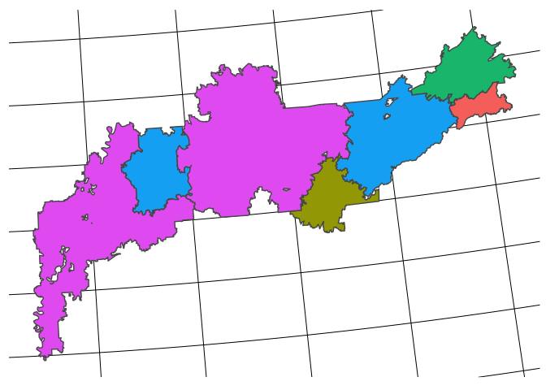
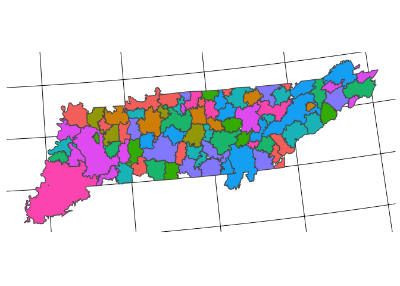

construct-dartmouth-geography-data.R
================
johngraves
Tue Jan 29 21:33:38 2019

``` r
####################################################
####################################################
####################################################
# Create HRR and HSA Boundary and Data Files
####################################################
####################################################
####################################################

# The objective of this document is to construct the HRR, HSA, and PCSA 
# boundary and data files from the underlying ZCTA data. 
# The reason we do this over using the boundary files constructed by Dartmouth
# is that those files lack sufficient information to obtain contiguous 
# market area data. 

# Also, this file serves as a blueprint more generally for obtaining 
# polygon data frames and contiguous areas data for any clustering of
# a smaller geographic unit (e.g., counties to markets). 

suppressWarnings(suppressMessages(source(here::here("/R/manifest.R"))))
source(here("R/move-ak-hi.R"))
source(here("R/get-geographic-info.R"))
source(here("R/map-theme.R"))
source(here("R/shared-objects.R"))
source(here("R/get-contiguous-areas.R"))

# Get information on PCSA state, etc. (this is merged on later)
pcsa_info <- foreign::read.dbf(here("public-data/shape-files/dartmouth-hrr-hsa-pcsa/ct_pcsav31.dbf")) %>% 
  janitor::clean_names() %>% 
  select(pcsa,pcsa_st, pcsa_l) %>% 
  mutate_at(vars(pcsa,pcsa_st,pcsa_l),funs(paste0)) %>% 
  unique()

# ZCTA to PCSA Crosswalk (merges on PCSA state from above)
zcta_to_pcsa <- foreign::read.dbf(here("public-data/shape-files/dartmouth-hrr-hsa-pcsa/zip5_pcsav31.dbf")) %>% 
  janitor::clean_names() %>% 
  mutate(pcsa = paste0(pcsa)) %>% 
  left_join(pcsa_info,"pcsa")

# ZCTA to HRR and HSA Crosswalk
zcta_to_hrr_hsa <- read_csv(here("public-data/shape-files/nber-hrr-hsa-pcsa/ziphsahrr2014.csv")) %>% 
  janitor::clean_names() %>% 
  rename(zip5 = zipcode )
```

    ## Parsed with column specification:
    ## cols(
    ##   zipcode = col_character(),
    ##   hsanum = col_double(),
    ##   hsacity = col_character(),
    ##   hsastate = col_character(),
    ##   hrrnum = col_double(),
    ##   hrrcity = col_character(),
    ##   hrrstate = col_character(),
    ##   year = col_double()
    ## )

``` r
zcta_to_state <- read_csv(here("public-data/zcta-to-fips-county/zcta-to-fips-county.csv")) %>% 
  filter(row_number() !=1) %>% 
  rename(zip5 = zcta5) %>% 
  select(zip5,state = stab) %>% 
  unique() %>% 
  group_by(zip5) %>% 
  mutate(n=paste0("state_",str_pad(row_number(), width=2,pad="0"))) %>% 
  filter(zip5!="99999") %>% 
  spread(n,state)
```

    ## Parsed with column specification:
    ## cols(
    ##   state = col_character(),
    ##   zcta5 = col_character(),
    ##   county = col_character(),
    ##   stab = col_character(),
    ##   cntyname = col_character(),
    ##   zipname = col_character(),
    ##   intptlon = col_character(),
    ##   intptlat = col_character(),
    ##   pop10 = col_character(),
    ##   afact = col_character()
    ## )

``` r
# Load the ZCTA Map Shape and merge in HRR, HSA, and PCSA Information
zcta_map_shape <-  sf::read_sf(here("public-data/shape-files/zcta-2017/tl_2017_us_zcta510/tl_2017_us_zcta510.shp")) %>% 
  sf::st_transform(crs ="+proj=aea +lat_1=29.5 +lat_2=45.5 +lat_0=37.5 +lon_0=-96") %>% 
  janitor::clean_names() %>% 
  mutate(zip5 = zcta5ce10) %>% 
  left_join(zcta_to_state,"zip5") %>% 
  filter(state_01 %in% states) %>% 
  left_join(zcta_to_pcsa,"zip5") %>% 
  left_join(zcta_to_hrr_hsa,"zip5") 
```

    ## Warning: Column `zip5` joining character vector and factor, coercing into
    ## character vector

``` r
df_hrr <- 
  zcta_to_hrr_hsa %>% 
  janitor::clean_names() %>% 
  select(contains("hrr")) %>% 
  unique()

df_hsa <- 
  zcta_to_hrr_hsa %>% 
  janitor::clean_names() %>% 
  select(contains("hsa")) %>% 
  unique()

df_pcsa <-
  zcta_to_pcsa %>% 
  janitor::clean_names() %>% 
  select(contains("pcsa")) %>% 
  unique()

####
# Construct shapefiles based on the intersection with HRR, HSA, and PCSA
####

sf_state <- sf::read_sf(here("output/tidy-mapping-files/state/01_state-shape-file.shp")) %>% 
  sf::st_transform(crs ="+proj=aea +lat_1=29.5 +lat_2=45.5 +lat_0=37.5 +lon_0=-96") %>% 
  st_simplify(dTolerance = 500) %>% 
  filter(stusps %in% c("TX","HI","AK")) %>% 
  move_ak_hi(state = stusps)

sf_hrr <- zcta_map_shape %>% 
  #filter(hrrstate %in% c("TX","HI","AK")) %>% 
  group_by(hrrnum) %>% 
  summarise() %>% 
  mutate(test = as.factor(sample(1:10,nrow(.),replace=TRUE))) %>% 
  st_simplify(dTolerance = 500) %>% 
  left_join(df_hrr, "hrrnum") %>% 
  move_ak_hi(state = hrrstate) 
  
sf_hrr_final <- sf_hrr %>% 
  left_join(get_contiguous(shp = sf_hrr, id = hrrnum) %>% mutate(hrrnum = as.numeric(paste0(hrrnum))), "hrrnum")

sf_hrr_final %>% 
  filter(hrrstate=="TN") %>% 
  ggplot() + 
  geom_sf(aes(fill = test)) + 
  remove_all_axes + 
  theme(legend.position = "none")
```

<!-- -->

``` r
 sf_hrr_final %>% 
  sf::write_sf(here("output/tidy-mapping-files/hrr/01_hrr-shape-file.shp"))


 sf_hsa <- zcta_map_shape %>% 
   group_by(hsanum) %>% 
   summarise() %>% 
   mutate(test = as.factor(sample(1:10,nrow(.),replace=TRUE))) %>% 
   st_simplify(dTolerance = 500) %>% 
   left_join(df_hsa, "hsanum") %>% 
   move_ak_hi(state = hsastate) 
 
sf_hsa_final <- 
  sf_hsa %>% 
   left_join(get_contiguous(shp = sf_hsa, id = hsanum) %>% mutate(hsanum = as.numeric(paste0(hsanum))), "hsanum")
 
 sf_hsa_final %>% 
   filter(hsastate=="TN") %>% 
   ggplot() + 
   geom_sf(aes(fill = test)) + 
   remove_all_axes + 
   theme(legend.position = "none")
```

<!-- -->

``` r
 sf_hsa_final %>% 
   sf::write_sf(here("output/tidy-mapping-files/hsa/01_hsa-shape-file.shp"))
 

sf_pcsa <- zcta_map_shape %>% 
   #filter(hrrstate %in% c("TN","HI","AK")) %>% 
   group_by(pcsa) %>% 
   summarise() %>% 
   mutate(test = as.factor(sample(1:10,nrow(.),replace=TRUE))) %>% 
   st_simplify(dTolerance = 500) %>% 
   left_join(df_pcsa, "pcsa") %>% 
   move_ak_hi(state = pcsa_st) 

sf_pcsa_final <- 
  sf_pcsa %>% 
  left_join(get_contiguous(shp = sf_pcsa, id = pcsa), "pcsa")

sf_pcsa_final %>% 
  sf::write_sf(here("output/tidy-mapping-files/pcsa/01_pcsa-shape-file.shp"))

 sf_pcsa_final %>% 
   filter(pcsa_st=="TN") %>% 
   ggplot() + 
   geom_sf(aes(fill = test)) + 
   remove_all_axes + 
   theme(legend.position = "none")
```

<!-- -->
