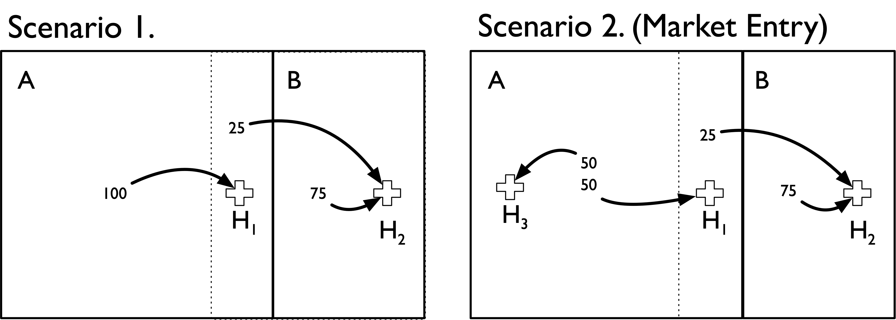
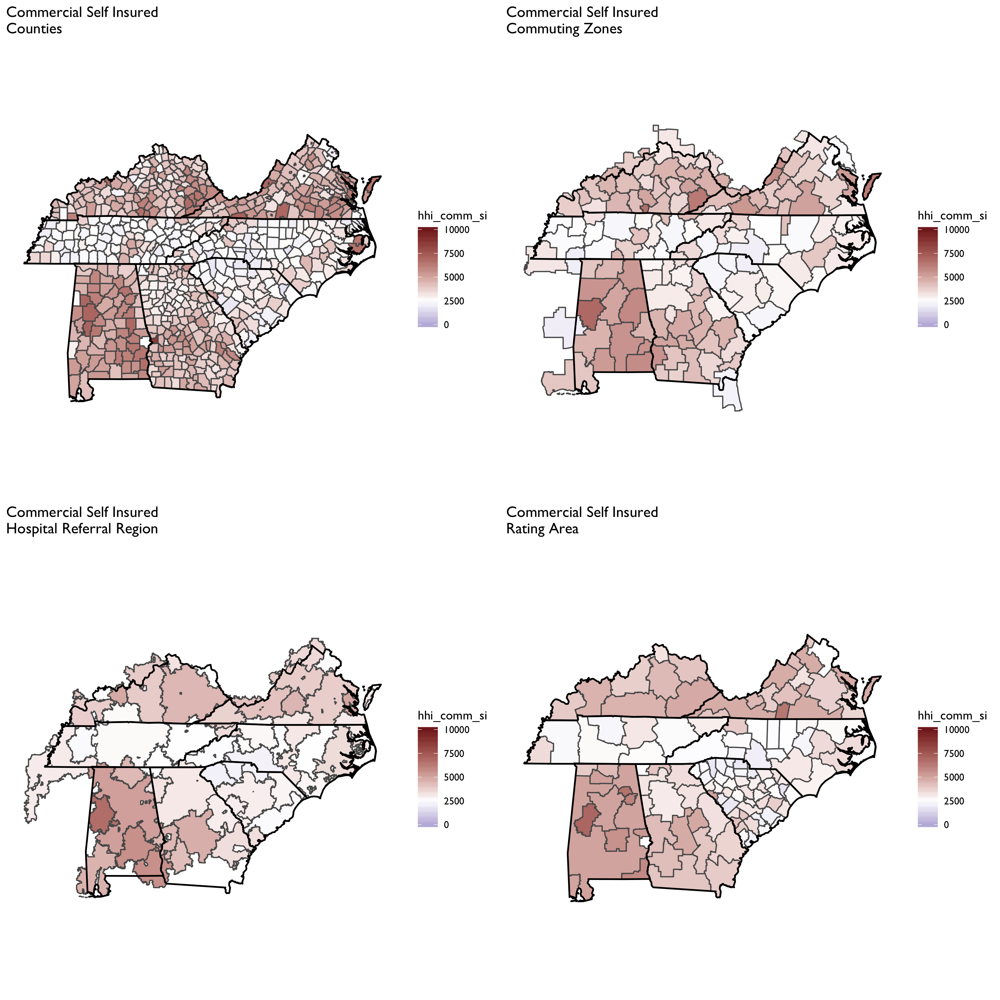
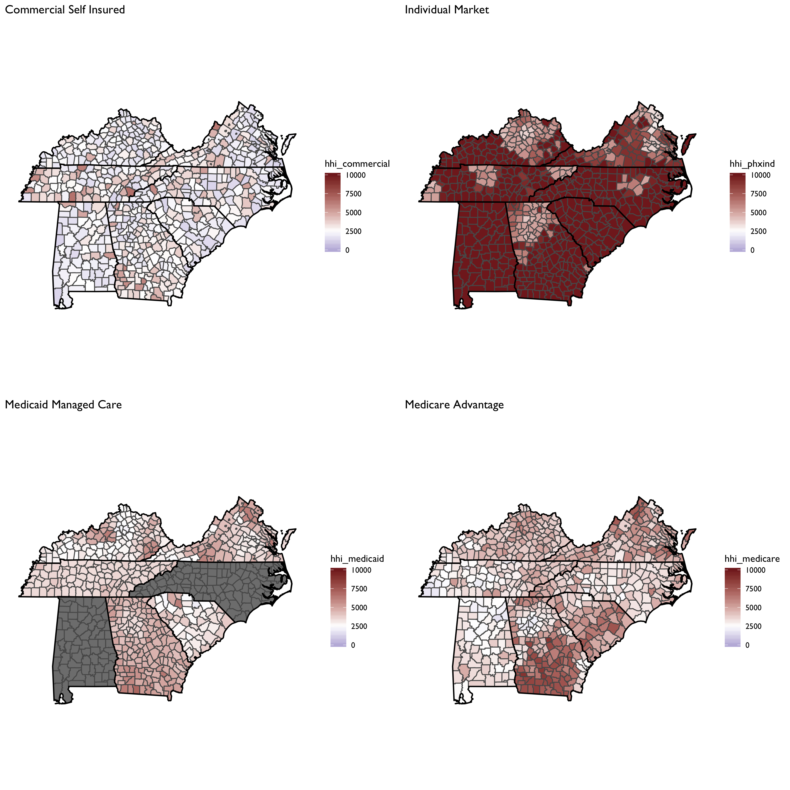
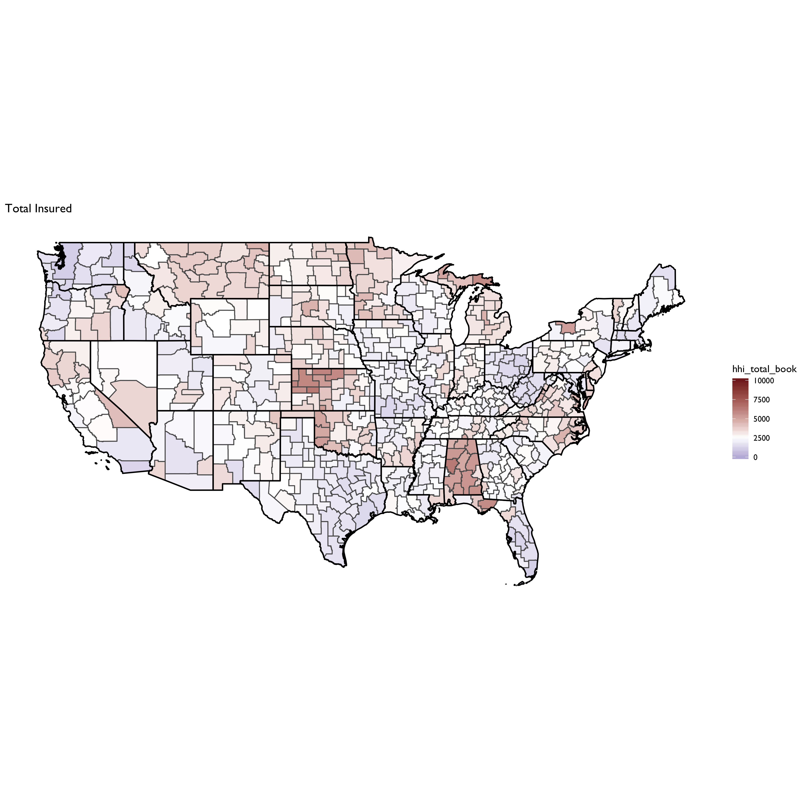
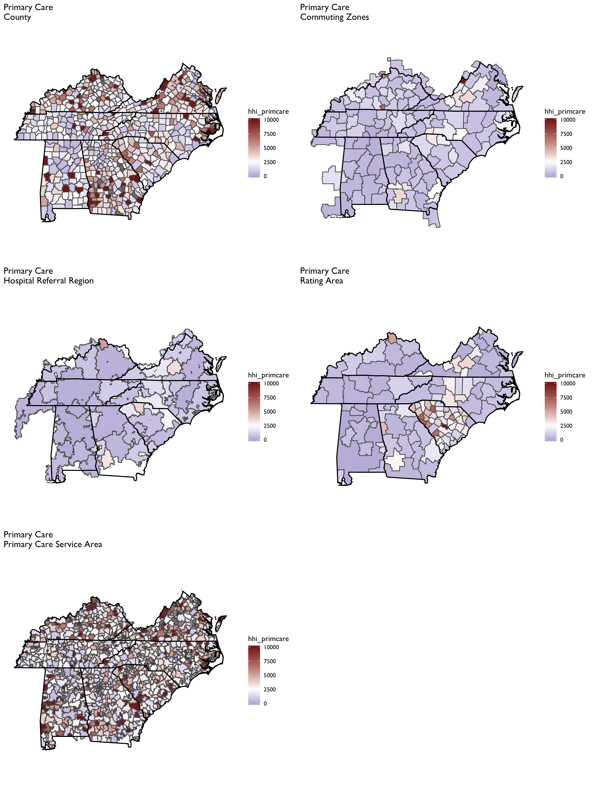
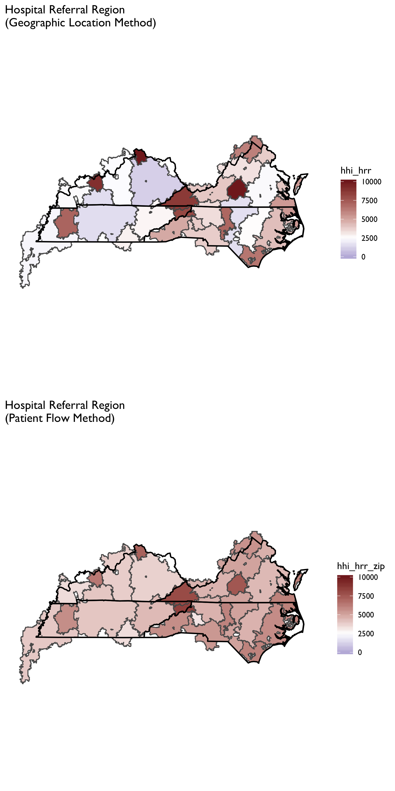
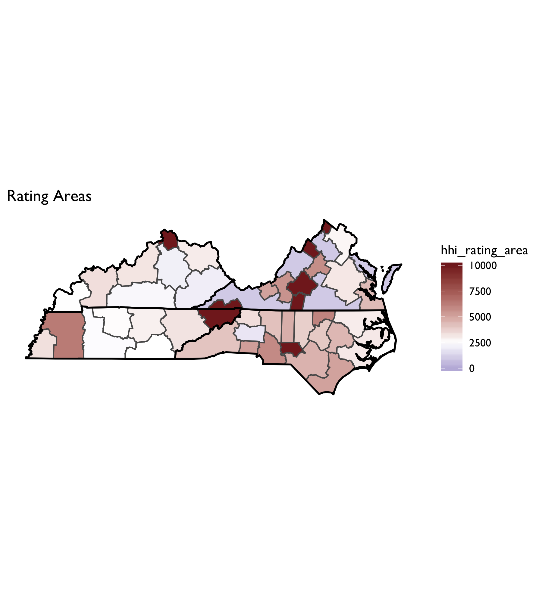
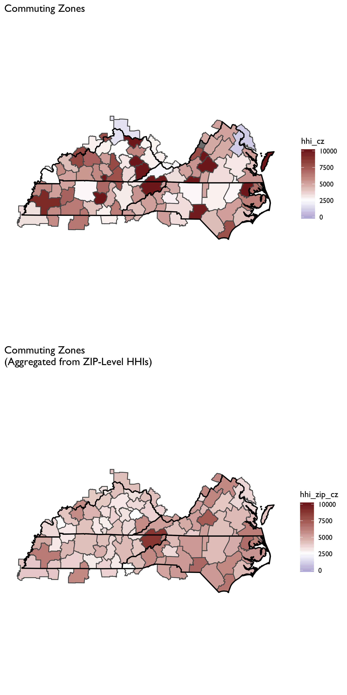
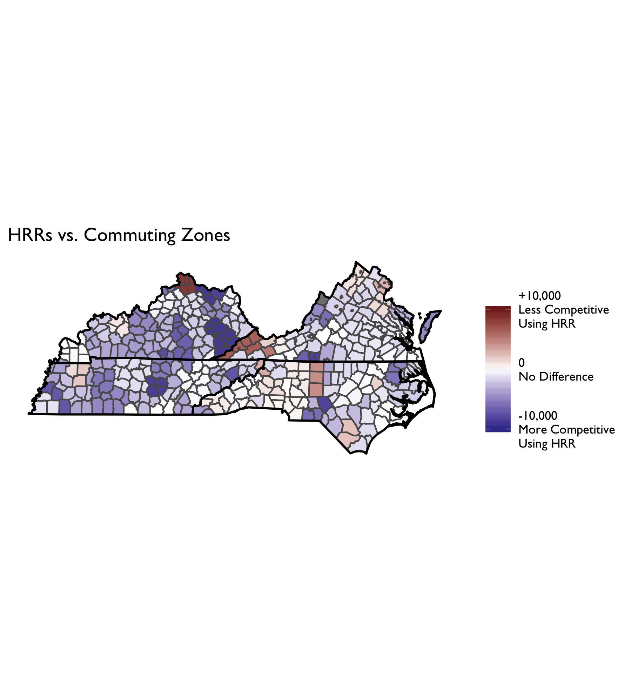
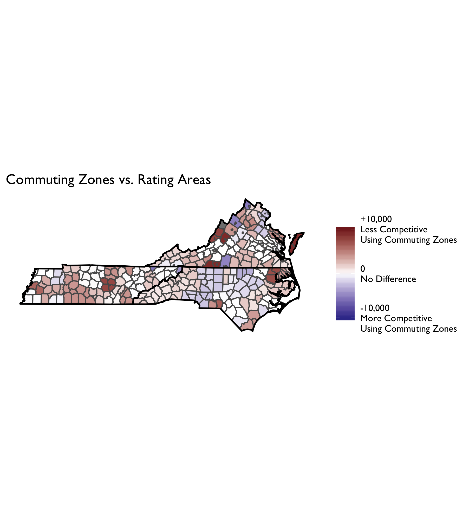

# Defining Geographic Markets for Health Care Services

The objective of this repository is to lay out some thoughts, analytics,
and data for defining geographic markets for health care services. In
other words, it is a guided tour of a particularly complex rabbit hole.

Geographic market definitions are important for a variety of regulatory
and research applications. Therefore, for any given use (e.g., analyses
of a health system or hospital merger) or measure (e.g., constructing a
Herfindahl-Hirschman index of market concentration) it is important to
know whether and how the analytic output varies by alternative market
definitions.

For example, suppose our goal is to characterize insurers, hospitals or
other providers by whether they operate in a concentrated market. If we
use a market geography definition that is too narrow (e.g., county) we
risk mischaracterizing markets as “concentrated” when they are really
not (i.e., Type I error). Alternatively, a market definition that is too
broad (e.g., state) risks characterizing markets as competitive when in
practice a hypothetical merger or market exit could materially affect
prices and competitiveness (i.e., Type II error).

Not surprisingly given the above issues, commonly used market
geographies have trade-offs. Whether the strengths outweigh the
weaknesses for a given application will depend on the specific research
or regulatory question at hand.

There are other important considerations at play as well. For example,
some market definitions are constrained by geopolitical boundaries
(e.g., state borders). While this may be fine for some settings (e.g.,
rate regulation in insurance markets, since consumers can only purchase
a plan offered in their market) it may not be for others (e.g.,
hospitial markets, in which patients are unconstrained from crossing
state boundaries).

In addition, the underlying population data used to define commonly used
geographic markets is out of date. The latest offical commuting zone
boundaries are derived from commuting patterns ascertained in the 2000
Census, though researchers have
[updated](https://sites.psu.edu/psucz/data/) these boundaries based on
2010 data. HRRs and HSAs, by comparison, are defined by patient flows to
hospitals in 1992 and 1993.

Clearly, flows patients and commuters have changed substantially in many
areas in the last 20-30 years. Whether these changes are material to
defining geographic boundaries of contemporary health care markets
remains an open question we will explore here.

Finally, it is worth mentioning that regulatory and antitrust reviews
have drawn on a diverse set of addtional market geography definitions.
The history, use and controversies surrounding these definitions are
nicely covered in the Department of Justice chapter entitled
[“Competition Law:
Hospitals.”](https://www.justice.gov/atr/chapter-4-competition-law-hospitals)
These alternative DOJ market definitions tend to rely on rich data on
prices in health care markets. While in theory such information could be
obtained nationwide, in practice the construction of market definitions
using price data is contigent on the painstaking collection of local
data from relevant market participants. I do not profess to have the
human capital or funding resources to undertake such an exercise here.
So we will focus on more general market geography definitions that can
more easily scale–particularly using publicly-available and relatively
low-cost data.

# Geographic Market Definitions

Before moving on it is useful to put down, in one place, the specific
methods and definitions used to construct each of the aforementioned
geographic market definitions.

## Hospital Service Areas (HSA)

HSAs are defined by the hospital care patterns of fee-for-service
Medicare beneficiaries. Specifically, a three-step process is used:

1.  Define all general acute care hospitals in the U.S. The town or city
    of the hospital location becomes the basis for HSA naming. Thus, if
    a given town has more than one hospital, those hospitals would be
    considered as part of the same HSA. In practice most HSAs end up
    with one hospital, however.

2.  Aggregate all Medicare visits to the hospital (or hospitals, in
    cases where towns or cities have \> 1 hospital). Using a plurality
    rule, assign ZIP codes to the HSA name where the most of its
    residents receive hospital care.

3.  Curate the HSA assignments to assure that only contiguous ZIPs make
    up the HSA.

In total there are 3,436 HSAs in the United States.

According to the Dartmouth methods appendix, data from 1992-93 were used
to construct HSA boundaries. However, crosswalks from ZIP code
tabulation area (ZCTA) to HSA are available on the Dartmouth website
through 2017. Since 3,436 unique HSAs appear in the latest (2017)
crosswalk this suggests that the updates only pertain to ZCTA updates,
rather than updates on the geographies of the underlying HSAs.

## Hospital Referral Regions (HRR)

Whereas HSAs are intented to capture the geographic catchment area where
residents of a ZIP code receive most of their overall hospital services,
HRRs are meant to capture larger teritary referral areas.

To identify HRRS, Dartmouth researchers aggregated HSAs into contiguous
geographies based on where residents of the HSA received the most
cardiovascular procedures and neurosurgeries. Thus, HSAs serve as the
basic building block of HRRs. HRRs are also constructed to meet the
following criteria:

  - Population of at least 120,000.
  - At least 65% of residents’ services occurred within the region.
  - Comprised of geographically contiguous HSAs.

In cases where the above criteria were not met, neighboring areas were
pooled together until all criteria were satisfied. There are 306 HRRs in
the United States.

## Primary Care Service Areas

PCSAs are intented to serve as HSAs for primary care. Thus, a PCSA is
defined as a collection of contiguous ZIP codes with at least one
primary care provider, and where the plurality of primary care services
is obtained among fee-for-service Medicare beneficiaries.

There are 6,542 PCSAs in the U.S. – or roughly double the number of
HSAs. On average there are 4.9 ZCTAs in a PCTA (median =3, max = 81, min
= 1). 61% of primary care services, on average, are obtained within
PCSAs.

## Marketplace Rating Areas

Marketplace rating areas are geographically contiguous areas used for
the purpopses of insurance plan rate setting in the non-group market.
The default geography used to set rating areas is the Metropolitan
Statistical Area (MSA) plus the remainder of the state not in an MSA
(MSA+1 definition). However, states have the option to define
alternative county, 3-digit ZIP, or MSA/non-MSA clusters if they deem
some alternative definition more important for regulation and rate
setting within the state.

In practice, only 7 states (AL, NM, ND, OK, TX, VA, WY) went along with
the default (MSA+1) standard. The vast majority of the states submitted
clusterings of counties as their rating area definitions. Another
handful of states (MA, NE, AK) uses clusters of 3-digit ZIP codes, while
CA uses a combination of counties and 3-digit ZIPs. Specifically, LA
county is split into two rating areas based on 3-digit ZIP.

What this means is there is signficant heterogeneity across states in
the geographic and population size of rating areas. South Carolina, for
example, has 46 rating areas – more than *double* the 19 rating areas
that define California\!

## Commuting Zones

Commuting zones are comprised of geographically contiguous counties with
strong within-area clustering of commuting ties between residental and
work county, and weak across-area ties. The [latest official commuting
zone geography
files](https://www.ers.usda.gov/data-products/commuting-zones-and-labor-market-areas/)
are based on patterns observed in the 2000 census. However, more recent
county-to-county commuting data are available based on the 2009-2013
American Community Survey (ACS) [are also
available](https://www.census.gov/data/tables/time-series/demo/commuting/commuting-flows.html)
and could be used to construct new commuting zone geographies.

For now, the zones used here will draw on the shapefiles constructed for
2010 at [Penn State](https://sites.psu.edu/psucz/).

This description of the history and methods of commuting zones from the
U.S. Department of Agriculture (USDA) is useful:

> The ERS Commuting Zones (CZs) and Labor Market Areas (LMAs) were first
> developed in the 1980s as ways to better delineate local economies.
> County boundaries are not always adequate confines for a local economy
> and often reflect political boundaries rather than an area’s local
> economy. CZs and LMAs are geographic units of analysis intended to
> more closely reflect the local economy where people live and work.
> Beginning in 1980 and continuing through 2000, hierarchical cluster
> analysis was used along with the Census Bureau’s journey to work data
> to group counties into these areas. In 2000, there were 709 CZs
> delineated for the U.S., 741 in 1990, and 768 in 1980. LMAs are
> similar to CZs except that they had to have a minimum population of
> 100,000 persons. LMAs were only estimated in 1980 and 1990. This was
> done in order for the Census Bureau to create microdata samples using
> decennial census data (1980 PUMS-D, 1990 PUMS-L) that avoided
> disclosure. The LMAs were discontinued in 2000 because researchers
> found them to be too large and not as useful as the CZs. The identical
> methodology was used to develop CZs for all three decades.

# Visualization of Market Definitions for Tennesee

We will next visualize several commonly used geographic market
definitions, including These HRRs, HSAs, primary care service areas
(PCSAs), commuting zones, and health insurance rating areas. These
market geographies are plotted for Tennessee in the figure below (though
some will also dip into adjacent states). Note that the colors in each
polygon are arbitrary and only intended to further highlight boundaries
across
geographies.

<!-- https://www.ahrq.gov/sites/default/files/wysiwyg/funding/contracts/HCUP_RFP_References/Wong_et_al_2005.pdf -->

<!-- -->

# How Do HHI Measures Compare Across Geographic Market Defintions?

Next we will consider HHI measures constructed based on the market
geographies defined above. For these examples we’ll focus on hospitals,
but in principle we could do the same for insurers, or physicians, if
sufficient data were available.

Before we do, however, it is useful to first lay out two different ways
this can be done for a given market geography. *These different methods
will yield different HHI measures for the same market geography* (e.g.,
CZ).

1.  **Geographic Location Method**: Under this method we identify all
    hospitals *located in the geographic market.* The HHI measure is
    constructed using market shares defined in terms of a head count of
    the number of hospitals, or in terms of total patients treated at
    each hospital (e.g, total admissions or total discharges), or
    possibly some other unit. This is a common method used to construct
    hospital HHIs.

2.  **Patient Flow Method**: Under this method we identify the set of
    hospitals that treat patients *who reside in the geographic market*
    (e.g., the CZ). Unlike the method above, this will bring in
    hospitals located outside the geographic market boundaries. Note
    that this can be done at a lower level of aggregation (e.g., at the
    ZIP code level). Then, those ZIP-level HHIs can be aggregated up to
    another market geography level (e.g. HRR) by taking a weighted
    average (with weights defined by population share, or total
    admission share, etc.).

It is worth noting that the patient flow method generally lines up
better with the underlying economic concept of what an HHI is trying to
capture. A simple example will demonstrate this.

## A Simple Example

Suppose there are only two geographic areas (A and B) and two hospitals
(H1 and H2). Areas A and B each contribute 100 hospital admissions, but
admissions from each area flow to specific local hospitals. That is,
admissions from area A *only* flow to hospital H1, and admissions from
area B *only* flow to hospital H2. Notably, however, both hospitals are
located in Area B (H1 is located in B but near the border with area A).
This scenario is depicted in the **Scenario 1** panel of the figure
below.

Now suppose that a single new hospital enters the market and locates in
area A. This new hospital redirects 50 admissions from H1 after it
enters the market. This scenario is depicted in the **Scenario 2** panel
of the figure.

Before we go about constructing HHI measures it is useful to think
through how we would *expect* an HHI measure to respond to this market
entry change. First, hospital H1 is now in a more competitive market
because the new hospital H3 siphoned off *half* of its admissions.
Second, hospital H2 was unaffected by market entry because none of its
patients moved to a different hospital

If we used the geographic location method to construct HHI measures we
would end up with the following estimates:

|                           | Area A | Area B |
| ------------------------- | -----: | -----: |
| Scenario 1                |     NA |   5000 |
| Scenario 2 (Market Entry) |  10000 |   5556 |

We can see through this simple example that the geographic location
method has done a poor job of capturing the underlying change in the
competitivenes of these two areas. In particular,

1.  In Scenario 1 we cannot even define an HHI measure for area A
    because no hospital happens to be located there; the hospital that
    all of its residents uses is just over the border in area B.

2.  In Scenario 2, Area A gets designated as highly concentrated (HHI =
    10,000). Again, this is because there is only one hospital located
    in in Area A.

3.  In Scenario 2, Area B (whose residents’ admissions patterns were
    unaffected by the new hospital) actually gets a slightly higher HHI
    value.

By comparison, the patient flow method does a better job of capturing
the competitive landscape:

|                           | Area A | Area B |
| ------------------------- | -----: | -----: |
| Scenario 1                |  10000 |  10000 |
| Scenario 2 (Market Entry) |   5000 |  10000 |

1.  In Scenario 1 we accurately capture the fact that both hospitals are
    operating in completely concentrated markets, drawing all patients
    from each of the respective areas.

2.  In Scenario 2 we accurately capture the change in competitiveness in
    Area A. The HHI measure drops from 10,000 to 5,000–reflecting the
    fact that the new hospital has redirected half of the inpatient
    admissions formerly going to hospital H1.

3.  In Scenario 2 we also accurately capture the fact that Area B had no
    change in the underlying competitiveness–the introduction of
    Hospital H3 did not affect admissions at H2, as we correspondingly
    see no change in our HHI measure.

It’s worth noting that the population flow method is also more robust to
alternative geographic market definitions. Suppose that we define a new
geographic boundary that includes H1 within area A. We’ll also draw (in
dotted lines) the previous geographic boundary from above, and assume
that 25 admissions from within that boundary area (i.e., the area
formerly in B) still go to H2. In other words, the only thing that has
changed is the (arbitrary) geographic boundary point delineating area A
from B.

We can see that both methods now produce the same HHI measures.
Moreover, the population flow method results are unchanged with this
(arbitrary) change in boundaries. *Thus, it is more robust to the
overall geographic market definition used.*

|                           | Area A | Area B |
| ------------------------- | -----: | -----: |
| Scenario 1                |  10000 |  10000 |
| Scenario 2 (Market Entry) |   5000 |  10000 |

By comparison, if we used the population flow method we would get the
following:

|                           | Area A | Area B |
| ------------------------- | -----: | -----: |
| Scenario 1                |  10000 |  10000 |
| Scenario 2 (Market Entry) |   5000 |  10000 |

An important takeaway from this exercise is that HHI measures defined
using the geographic location method make an important and very strong
assumption: **the geographic boundaries used capture all (or nearly all)
of the relevant economic activity under consideration (e.g., hospital
admissions).**

## Comparison of Geographic Location and Population Flow HHI Measures

The next set of maps show how these two different HHI construction
methods yield different answers for the same geographic market
definition. We’ll consider both HRRs and CZs for this example, and focus
on maps of TN, NC, VA and KY (though the underlying data cover the
entire US). The geographic area at the intersection of these states was
recently the focus of a major merger of two large health systems
(Mountain States Health Alliance and Wellmont Health System) that [drew
attention due to antitrust
concerns](https://www.modernhealthcare.com/article/20161123/NEWS/161129951).

To construct these maps the two methods above were used, with the
following specific details.

  - Sample is general acute care hospitals identified in the 2017 AHA
    Annual Survey data.

  - We define HHI measures at the system level, not the hospital level.
    Thus, all HCA hospitals get rolled up into a single HCA row.

  - For the Geographic Location HHI Method, we identify all hospitals
    within the geographic area. We then then construct HHI measures
    based on market shares defined by FFS Medicare Patients. Note that
    this allows us to be consistent with the patient definition used in
    the patient flow method, as describd below. In practice this yielded
    nearly identical HHI measures when total admissions were used, as
    shown in the plot below.

<!-- -->

  - For the patient flow method, we used the [CMS Hospital Service Area
    files
    for 2017](https://www.cms.gov/Research-Statistics-Data-and-Systems/Statistics-Trends-and-Reports/Hospital-Service-Area-File/index.html)
    to construct ZIP-level HHI measures. These zip-level HHI measures
    were based on the hospitals visited among FFS Medicare patients in
    each ZIP code. We then aggregated these ZIP level measures to the
    HRR or CZ level using a weighted average (with weights defined by
    total FFS Medicare patient volume from the ZIP).

Maps for each geographic market definition (HRR, CZ) and HHI
construction method (geographic location, patient flow) are provided
below.

We can see here that the geographic location method produced a more
fragmented HRR map, with adjacent HRRs ranging from highly concentrated
to not concentrated. With the patient flow method (aggregated to HRR or
CZ) we see that the map evens out considerably. Notably, areas tend to
become more concentrated, though some areas that appear highly
concentrated using the geographic location method become less so when
using patient flows. The patient flow method, in other words, appears to
even out some rough edges seen in the geographic location maps.

It is also notable that the patient flow method yielded very similar
maps when using HRRs vs. CZs. In part this is by construction, since
both rely on the same underlying ZIP-level data. But it is striking to
see in the top panels how different HHI measures can be using the
geographic location method for CZs and HRRs. In particular, HRRs
designate some areas as not concentrated while the same area is highly
concentrated under the CZ HHI measure.

# Market Concentation in Insurance Markets

Data on insurer consolidation are drawn from Managed Markets Surveyor
(MMS) from Decision Resources Group. The MMS data form the backbone of
the HealthLeaders-InterStudy data used in previous research on insurer
competition (Fulton 2017; Trish and Herring 2015). The MMS data provide
plan enrollment information at the insurer-county level. Enrollment is
provided overall and separately by market type (commercial fully
insured, commercial self-insured, Medicare Advantage, Medicaid Managed
Care, and ACA-compliant non-group insurance). Enrollment is derived for
enrollees’ county of residence, not the county of the employer or
insurer. MMS data are sourced directly from health plans, and the
underlying census survey of plans has an 88% response rate, covering
approximately 94% of insured lives in the U.S. (Personal communication
with DRG on 8/26/16). The MMS data are routinely used by health plans
and pharmaceutical companies for market analytics.

First let’s compare the aggregate HHI measures by different geographic
market definitions:

Now let’s focus on a county-level measure, and plot HHI measures by
market segment:

And total insured: 

# Physician-Level HHI

The SK\&A data are the basis of the HHI measures for office-based
physicians, as described in Richards et al. (2017).

From Richards et al. (2017):

> We construct three different measures of a Herfindahl‐Hirschman Index
> (HHI) for physician markets…. Each measure reflects the allocation and
> organization of all physician specialists within a given geographic
> area. In other words, we capture if an insurer would have relatively
> few or many physician practices to negotiate with in regard to
> enrollee access and payments (as well as other contractual
terms).

<!-- For these plots the HHI measure is constructed using admission-weighted market shares for hospitals within each geographic market. The hospital data are drawn from the 2017 AHA annual survey.  -->

<!--  -->

<!--  -->

<!--  -->

<!--  -->

<!--  -->

<!-- ## Simpson's Paradox and HHIs -->

<!--  -->

<!-- Now let's consider the *difference* between HHI measures in a given county for each geographic market definition. That is, if the HHI value using HRRs in 5,000, while it is 1,000 using commuting zones, the difference would be 4,000.  We plot these differences in the maps below. The maps are useful in demonstrating geographic areas where characterizations of market concentration will be highly dependent on the geographic market definition used.  -->

<!--  -->

<!--  -->

<!--  -->

<!-- # Novel Market Definitions -->

<!-- In this section we will consider several methodological improvements and extensions to the geographic definitions covered above.  These include: -->

<!-- - Updates to HSAs and HRR definitions based on more recent data. -->

<!-- - Geographic market definitions based on community detection algorithms borrowed from social network analytic methods.  -->

<!--     - Based on hospital-ZIP data from Medicare. -->

<!--     - Based on insurer-county data from DRG. -->

<!--     - Based on shared patient networks from Medicare.  -->

<!--     - Based on updates to commuting flows from 2009-2013. Census data [here](https://www.census.gov/data/tables/time-series/demo/commuting/commuting-flows.html). Based on gravity model or based on Dartmouth method (e.g., greatest fraction). -->

<!--     - Based on hospital-specific HHIs. -->

<!-- ### Rural-Urban Commuting -->

<!-- [Rural-Urban Commuting Codes](https://www.ers.usda.gov/data-products/rural-urban-commuting-area-codes.aspx) -->

<!-- > The rural-urban commuting area (RUCA) codes classify U.S. census tracts using measures of population density, urbanization, and daily commuting. The most recent RUCA codes are based on data from the 2010 decennial census and the 2006-10 American Community Survey. The classification contains two levels. Whole numbers (1-10) delineate metropolitan, micropolitan, small town, and rural commuting areas based on the size and direction of the primary (largest) commuting flows. These 10 codes are further subdivided based on secondary commuting flows, providing flexibility in combining levels to meet varying definitional needs and preferences.  -->

<!-- 1   Metropolitan area core: primary flow within an urbanized area (UA)  -->

<!-- 2.  Metropolitan area high commuting: primary flow 30% or more to a UA  -->

<!-- 3   Metropolitan area low commuting: primary flow 10% to 30% to a UA    -->

<!-- 4   Micropolitan area core: primary flow within an Urban Cluster of 10,000 to 49,999 (large UC)     -->

<!-- 5   Micropolitan high commuting: primary flow 30% or more to a large UC -->

<!-- 6   Micropolitan low commuting: primary flow 10% to 30% to a large UC   -->

<!-- 7   Small town core: primary flow within an Urban Cluster of 2,500 to 9,999 (small UC)  -->

<!-- 8   Small town high commuting: primary flow 30% or more to a small UC -->

<!-- 9   Small town low commuting: primary flow 10% to 30% to a small UC     -->

<!-- 10. Rural areas: primary flow to a tract outside a UA or UC     -->

<!-- 99. Not coded: Census tract has zero population and no rural-urban identifier information   -->

# File Descriptions

  - [R/manifest.R](R/manifest.R) sets up all libraries and settings.
  - [R/move-ak-hi.R](R/R/move-ak-hi.R) moves Alaska and Hawaii in a map.
  - [R/map-theme.R](R/map-theme.R) defines plotting and theme parameters
    for mapping.
  - [R/get-geographic-info.R](R/get-geographic-info.R) obtains centroid
    and contiguous geography data for any underlying shape object.
  - [R/zip-code-crosswalk.R](R/zip-code-crosswalk.R) creates a ZCTA to
    FIPS code crosswalk from the [MAPLE geographic crosswalking
    website](http://mcdc.missouri.edu/applications/geocorr2014.html).

## Geographic Mapping Files

  - The file
    [R/construct-county-map-data.R](R/construct-county-map-data.md)
    constructs ggplot-friendly mapping data for U.S. counties
    (`output/tidy-mapping-files/county/df_county.rds`). It also extracts
    contiguous counties and estimates county centroids
    (`output/tidy-mapping-files/county/df_county_info.rds`).

  - The file
    [R/construct-rating-area-data.R](R/construct-rating-area-data.md)
    constructs ggplot-friendly rating area map data based on the
    marketplace rating area definitions as of 2019-01-23 (these have
    barely changed, if any, over time, however). The sub-program
    [R/construct-rating-area-file-from-cciio-website.R](construct-rating-area-file-from-cciio-website.R)
    reads the HTML tables from the CCIIO website, which list either the
    counties or ZIP3 for each rating area. The program also separately
    creates 3-digit ZIP rating areas for Los Angeles county–the only
    county in CA that uses 3-digit ZIPs; however, the 3-digit ZIPs in LA
    County also span other counties, requiring some further manipulation
    to get the intersection.

  - The file
    [R/construct-dartmouth-geography-data.R](R/construct-dartmouth-geography-data.md)
    constructs ggplot-friendly mapping data for Dartmouth Atlas
    geographies including Hospital Referral Region (HRR), Hospital
    Service Region (HSA) and Primary Care Service Region (PCSA). It also
    constructs a data file listed at the geographic market level, and
    which contains data on centroids and contiguous markets. Note that
    the basis for these files is the ZIP to HRR/HSA and PCSA crosswalk
    files available for download at the [NBER
    website](https://www.nber.org/data/dartmouth-atlas-geography.html)
    and in [archived versions of the Dartmouth Atlas
    webpage](http://archive.dartmouthatlas.org/tools/downloads.aspx?tab=42).
    There are also shapefiles already constructed and [available for use
    on the archived Dartmouth
    website](http://archive.dartmouthatlas.org/tools/downloads.aspx?tab=39)–though
    I found these difficult to work with (e.g., I could not easily
    extract contiguous geographies using them, as I can by building up a
    HRR/HSA/PCSA shapefile from a ZCTA map)

  - The file
    [R/construct-commuting-zone-data.R](R/construct-commuting-zone-data.md)
    constructs ggplot-friendly mapping data for Commuting Zones defined
    using the 2000 census. The underying county-to-commuting zone data
    can be found on the [USDA
    website](https://www.ers.usda.gov/data-products/commuting-zones-and-labor-market-areas/).

## Patient Sharing Files

  - The file
    [R/read-and-tidy-cms-hospital-service-areas.R](R/read-and-tidy-cms-hospital-service-areas.R)
    reads in the CMS Hospital Service Area file for 2017. Note the
    source of these data are downloaded csv files from the interactive
    CMS data explorer available at the links at [this
    link](https://www.cms.gov/Research-Statistics-Data-and-Systems/Statistics-Trends-and-Reports/Hospital-Service-Area-File/index.html).
    The final file is rolled up to the FIPS county level and is storeed
    in
    `output/hospital-county-patient-data/2017/hospital-county-patient-data.rds`.

Fulton, Brent D. 2017. “Health Care Market Concentration Trends in the
United States: Evidence and Policy Responses.” *Health Affairs* 36 (9):
1530–8.

Richards, Michael R., Catherine T. Smith, Amy J. Graves, Melinda B.
Buntin, and Matthew J. Resnick. 2017. “Physician Competition in the Era
of Accountable Care Organizations.” *Health Services Research*, March.
<https://doi.org/10.1111/1475-6773.12690>.

Trish, Erin E., and Bradley J. Herring. 2015. “How Do Health Insurer
Market Concentration and Bargaining Power with Hospitals Affect Health
Insurance Premiums?” *Journal of Health Economics* 42: 104–14.

